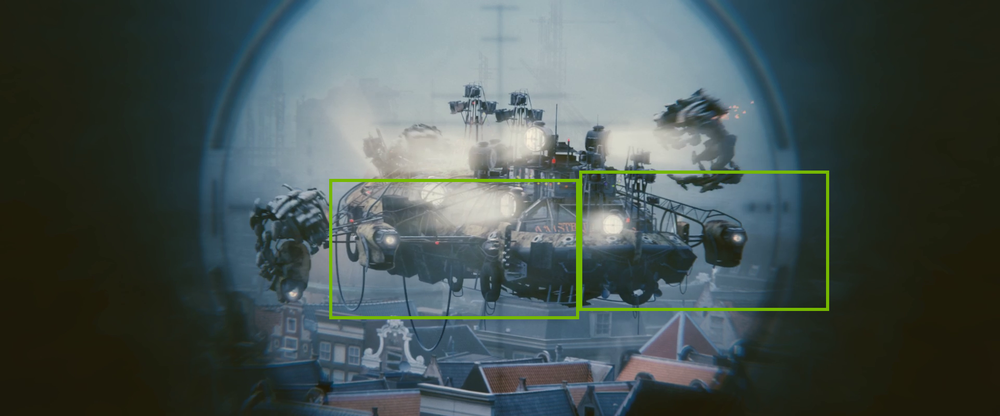
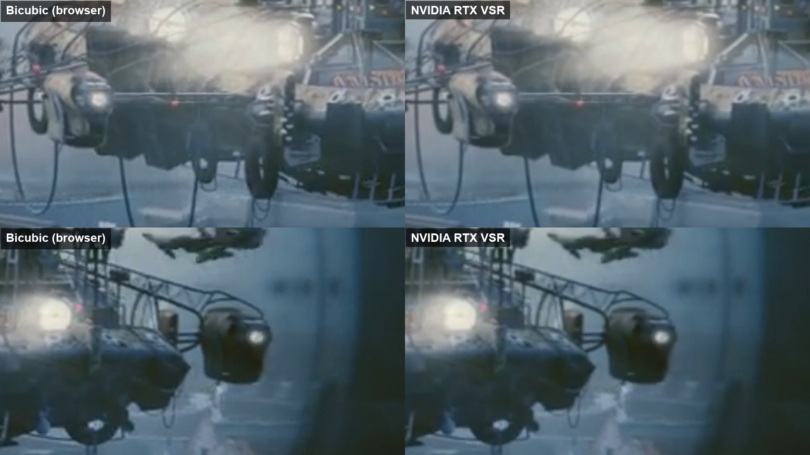
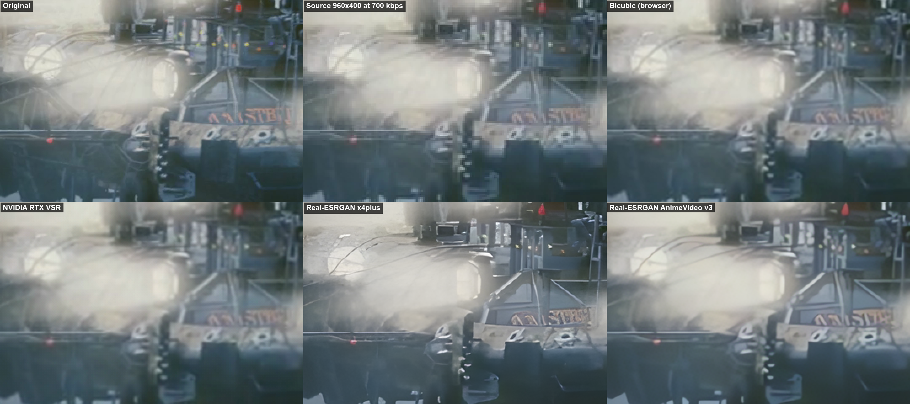
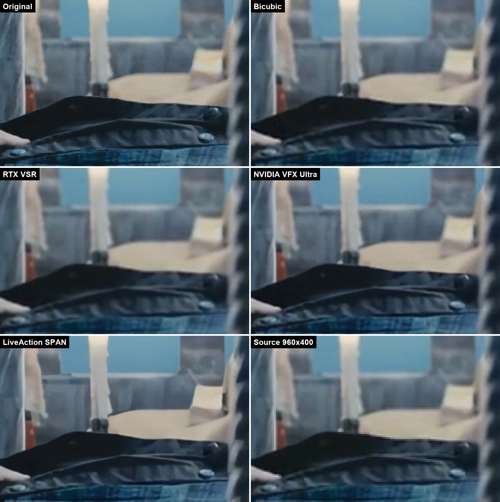
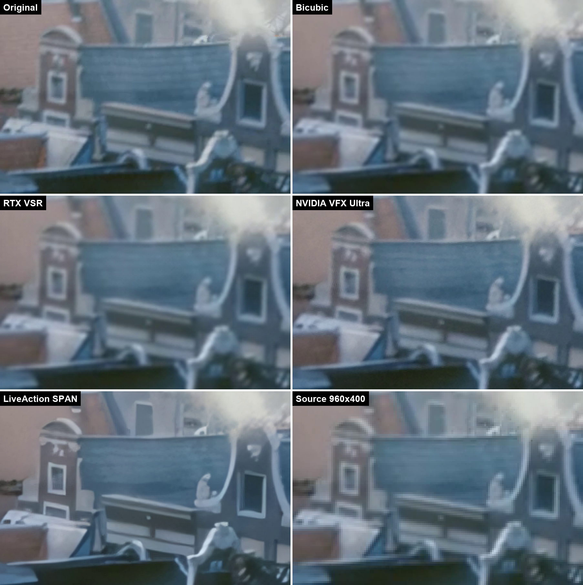
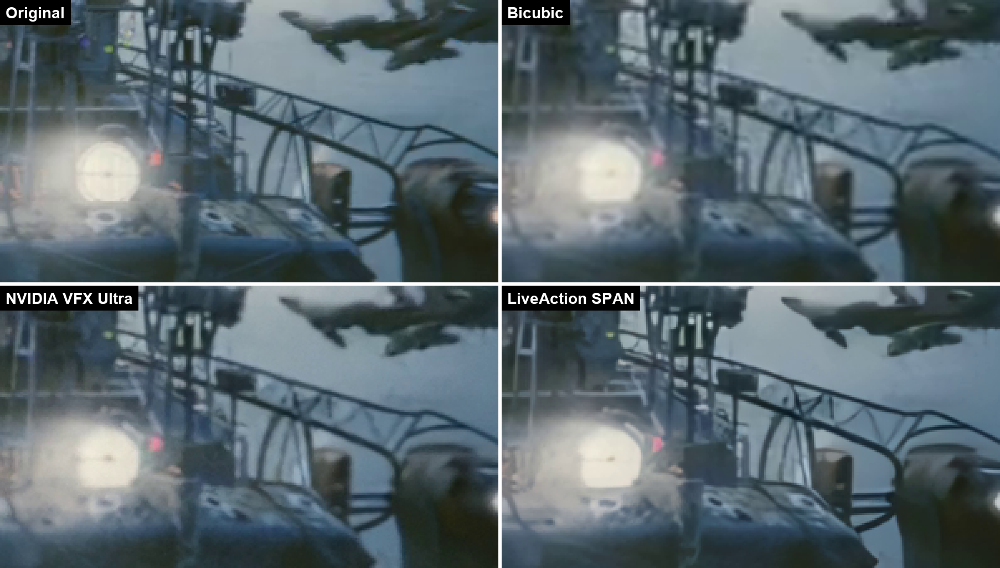

# Bench results

## v1 — bicubic vs NVIDIA RTX VSR (2026-10-08)

Setup: `python bench/bench.py all` on an RTX 4050 Laptop GPU, driver RTX VSR via mpv `d3d11vpp scaling-mode=nvidia`.

Clip: *Tears of Steel* 98 s + 20 s (480 frames). Reference 1920x800 (clean 1080p release). Source: downscaled 2x to 960x400 and re-encoded as H.264 at 700 kbit/s — a typical low-quality web stream. Both variants upscale the source 2x back to 1920x800 and are compared with the clean reference.

| Variant | PSNR (dB) | SSIM |
|---|---|---|
| Bicubic (what a browser does) | **41.91** | **0.9783** |
| NVIDIA RTX VSR (driver) | 41.02 | 0.9748 |

Frame alignment checked: shifting the RTX VSR output by one frame drops PSNR to 30–31 dB, so the 41 dB match is frame-exact.

Close-up (left to right: original, source, bicubic, RTX VSR):

**Takeaway:** on a heavily compressed source, driver RTX VSR is visually almost identical to bicubic and slightly *further* from the original by PSNR/SSIM. It smooths, but does not restore detail or text. This matches what our first tester saw on real web video and is the baseline ClearFrame has to beat.

### Zoom videos

The bench now picks the most detailed regions automatically and renders the same regions for every variant (see [bench/README.md](../bench/README.md)). Regions for this clip:

Frame from `zoom/bicubic-vs-rtx-vsr.mp4` (bicubic left, RTX VSR right):

### Preview: what a heavy neural model can do (not real-time)

Same frame (t = 10 s), same 3x zoom. Real-ESRGAN models run through `realesrgan-ncnn-vulkan` v0.2.5.0 (Vulkan, not Tensor Cores), x4 output resized to 1920x800.

- **Real-ESRGAN x4plus** (large general model) restores hard edges — cables, hull outlines, lamps, lettering — that every other variant leaves blurred. But it also flattens texture: smoke and metal turn into smooth, painted-looking areas. ~5 s per 960x400 frame on an RTX 4050 Laptop (incl. model load) — far from the 42 ms real-time budget at 24 fps.
- **Real-ESRGAN AnimeVideo v3** (compact, anime-trained) is fast but looks close to bicubic on live action.

That is the target in one picture: x4plus-level edge restoration, without the painted look, at real-time speed on Tensor Cores.

Next: neural models through TensorRT (roadmap part 2) and a harder 3x source (640x267).

---
Footage: "Tears of Steel" (CC BY 3.0) (c) Blender Foundation | mango.blender.org

## v2 — neural engines (2026-10-09)

Same clip and source. New variants: NVIDIA Video Effects SDK *VideoSuperRes* (`pip install nvidia-vfx`, HIGH and ULTRA) and **2xLiveActionV1_SPAN** by jcj83429 (CC-BY-NC-SA-4.0) — a SPAN network trained on live action with JPEG / MPEG-4 / H.264 / VP9 / H.265 compression, chroma subsampling, rescaling blur and halos. `python bench/bench.py vfx`, `python bench/bench.py liveaction-span`.

| Variant | PSNR (dB) | SSIM | Speed, RTX 4050 Laptop |
|---|---|---|---|
| Bicubic | 41.91 | 0.9783 | — |
| NVIDIA RTX VSR (driver) | 41.02 | 0.9748 | driver |
| NVIDIA VFX SuperRes High | 40.66 | 0.9750 | 7 ms (720p→1440p) |
| NVIDIA VFX SuperRes Ultra | 40.81 | 0.9727 | 9 ms (720p→1440p) |
| 2xLiveActionV1 SPAN (TensorRT FP16) | 40.20 | 0.9755 | 22 ms (960x400→2x) |

PSNR punishes every reconstructed edge that is not pixel-exact, so here it ranks plain blur first. The close-ups tell the real story (3x, nearest neighbour):

**Takeaway:** LiveAction SPAN is clearly the closest to the original on edges, window frames, buttons and text; fine flat texture gets slightly smoothed. NVIDIA VFX is a little cleaner than bicubic; driver RTX VSR is the softest of all. LiveAction SPAN becomes ClearFrame's default live engine (`engine/neural.py`, `live/gpu_stage.py`): one TensorRT FP16 engine for inputs up to 1024x576 — 72 fps at 640x360, 46 fps at 960x400, 29 fps at 1024x576. Bigger inputs go to NVIDIA VFX when installed.
