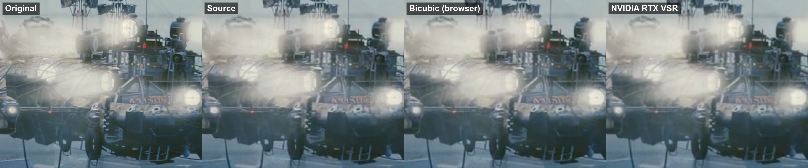

# Bench results

## v1 — bicubic vs NVIDIA RTX VSR (2026-10-08)

Setup: `python bench/bench.py all` on an RTX 4050 Laptop GPU, driver RTX VSR via mpv `d3d11vpp scaling-mode=nvidia`.

Clip: *Tears of Steel* 98 s + 20 s (480 frames). Reference 1920x800 (clean 1080p release). Source: downscaled 2x to 960x400 and re-encoded as H.264 at 700 kbit/s — a typical low-quality web stream. Both variants upscale the source 2x back to 1920x800 and are compared with the clean reference.

| Variant | PSNR (dB) | SSIM |
|---|---|---|
| Bicubic (what a browser does) | **41.91** | **0.9783** |
| NVIDIA RTX VSR (driver) | 41.02 | 0.9748 |

Frame alignment checked: shifting the RTX VSR output by one frame drops PSNR to 30–31 dB, so the 41 dB match is frame-exact.

Close-up (left to right: original, source, bicubic, RTX VSR):

**Takeaway:** on a heavily compressed source, driver RTX VSR is visually almost identical to bicubic and slightly *further* from the original by PSNR/SSIM. It smooths, but does not restore detail or text. This matches what our first tester saw on real web video and is the baseline ClearFrame has to beat.

Next: add neural models through TensorRT (roadmap part 2) and a harder 3x source (640x267).

---
Footage: "Tears of Steel" (CC BY 3.0) (c) Blender Foundation | mango.blender.org
